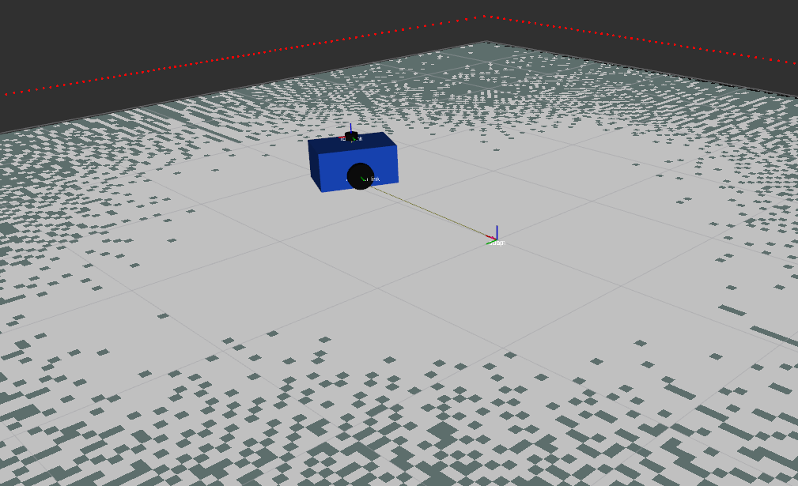
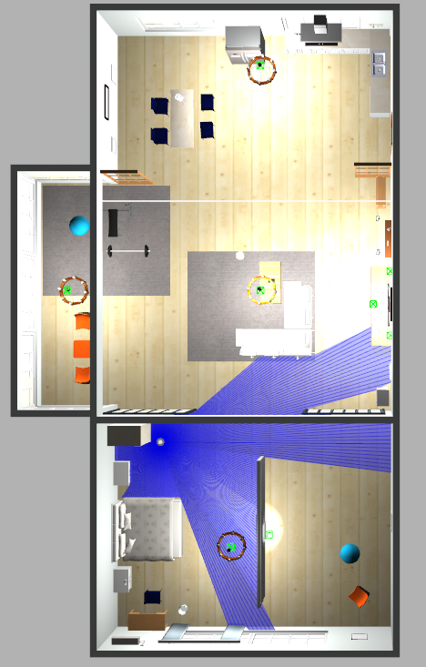
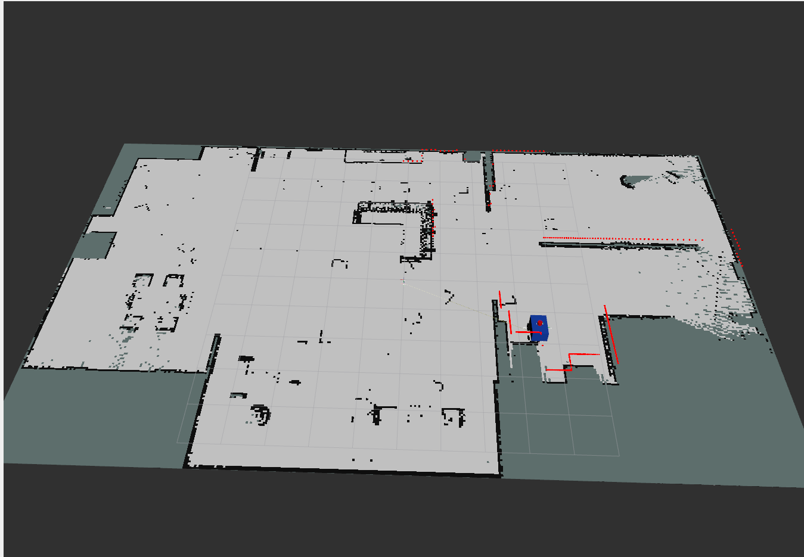

## Simulation

### Initial RViz Visualization

The initial setup provides a basic RViz visualization of the robot environment. This view is used to verify the robot model, coordinate frames, and sensor visualization before starting the complete simulation.

### Gazebo Simulation

The robot is simulated in a Gazebo environment representing the target world. The simulation includes the robot model along with its LiDAR sensor, allowing the robot to perceive and interact with the simulated environment.

### RViz — Robot and LiDAR Visualization

RViz is used to visualize the robot's state and LiDAR sensor data in real time. The LiDAR measurements are displayed together with the robot and environment, providing a clear view of the sensor's perception and the robot's position within the world.

